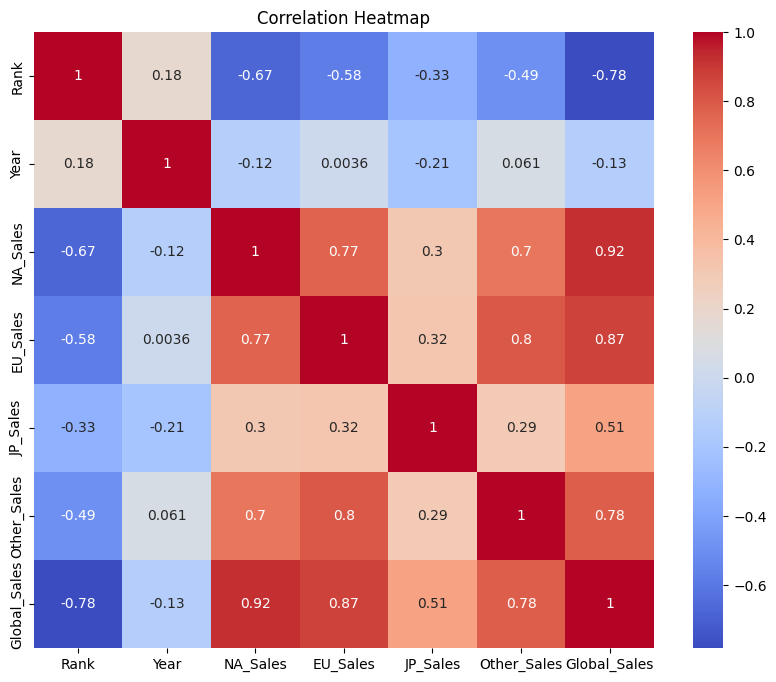
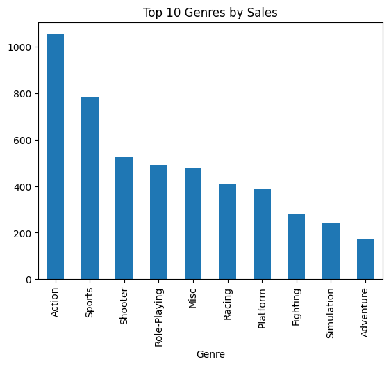

````markdown
# 🎮 Video Game Sales EDA

> **#Python #DataScience #EDA #MachineLearning #Pandas #NumPy #ScikitLearn #DataVisualization #GitHub**

An end-to-end **Exploratory Data Analysis (EDA)** project on the **Video Game Sales** dataset using Python. This project demonstrates data cleaning, exploratory analysis, feature engineering, and data visualization to uncover business insights and prepare the dataset for machine learning.

## Overview

> **#DataCleaning #FeatureEngineering #Analytics**

- Analyzed **16,598+** video game records
- Cleaned and preprocessed raw data
- Handled missing values and duplicate records
- Performed outlier analysis using the IQR method and log transformation
- Explored sales trends across regions, genres, platforms, and publishers
- Created new features and encoded categorical variables for ML readiness

## Tech Stack

> **#Python #Pandas #NumPy #Matplotlib #Seaborn #ScikitLearn #JupyterNotebook**

- Python
- Pandas
- NumPy
- Matplotlib
- Seaborn
- Scikit-learn
- Jupyter Notebook

## Key Insights

> **#BusinessInsights #DataAnalysis**

- Action and Sports are the highest-selling genres.
- North America and Europe contribute the largest share of global sales.
- Wii, PS2, and Nintendo DS are among the best-performing platforms.
- A small number of publishers dominate the global market.

## Project Structure

> **#ProjectStructure #GitHub**

```text
VideoGameSalesEDA/
├── data/
├── notebooks/
├── images/
├── report/
├── README.md
└── requirements.txt
````
# 📊 Visualizations

## Correlation Heatmap



---

## Sales by Genre



---

## Author

**Utsav Dasgupta**
B.Tech – Computer Science & Engineering (AI & ML)
Sikkim Manipal Institute of Technology

⭐ If you found this project useful, consider giving it a star!

```
```

